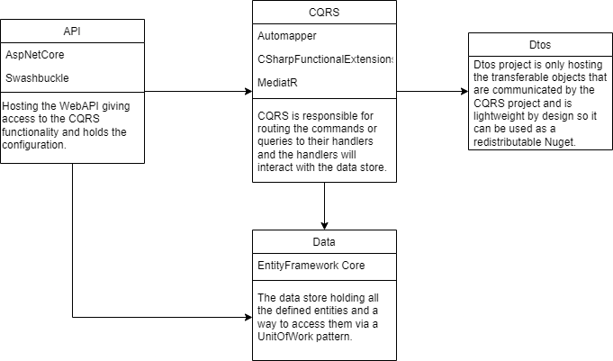

# Rebels Example .NET Project

## Intro
There are many different opinions and flavours on how to setup a .NET Project. In my career I have seen many differences in how solutions are being setup and how the .NET world evolved with new patterns and frameworks. In some cases it got better and in some cases it got worse.

The first patterns that I encountered in my career were simple MVC, where controllers did most of the lifting. Then we moved over to a more repository pattern, were the repositories (as we now see services) did most of the logic. Both these situations were in serverside rendered pages, so yes, views were actually a thing. Slowly the world moved to the usage of single page applications. Gone were the views! The separation in code was also noticable in the job titles, developers were separated between backend and frontend, except for the full-stacks, those developers can do anything! Than we saw the rise of the Model-Repository-Service-Controller pattern (it is made up, but you have probably seen it), which in my opinion is too much work without any real benefit.

Now we skip a couple of years ahead were there are multiple patterns and new frameworks that helps you with those patterns. With the release of the Entity Framework I still see solutions where the repository pattern is applied with Entity Framework, as well as the UnitOfWork pattern. 
Is that really needed? Entity Framework itself is already a repository/unitofwork pattern, so why add another layer?

I wanted to challenge myself how I would setup a new project with my current state of mind that is easily maintainable, easy to expand and not to dependend on 3rd party packages. 

## Version B
I have chosen to create a very dependency minimal project with CQRS and UnitOfWork pattern.
The version B deviates from [version A](https://github.com/ronaldbaltus/rebels-dotnet-api-example) in a way that the Data project has a hard dependency on EntityFramework, with that we make the project even more simpler because we don't have a UnitOfWork wrapper and we have a project less.

The idea is that CQRS Project isn't aware of being a HTTP API. This way you could create an CLI project for example as well, firing of CQRS messages through the system, and maybe I will add those in the future just to prove a point :)

What is your opinion of this setup? Is it future proof? Do you think it is maintainable and expandable?

## The projects in the solution

  
### API Project
__Responsibility__

Hosting the WebAPI giving access to the CQRS functionality and holds the configuration.

__Dependencies__
- AspNetCore
- Swashbuckle

### CQRS Project
__Responsibility__

CQRS is responsible for routing the commands or queries to their handlers and the handlers will interact with the data store.

__Dependencies__
- AutoMapper
- CSharpFunctionalExtensions
- MediatR

### Data Project
__Responsibility__

The data store holding all the defined entities and a way to access them via a UnitOfWork pattern and is implemented with Entityframe Core.

__Dependencies__
- Microsoft.EntityFrameworkCore

### DTO Project
__Responsibility__

Dtos project is only hosting the transferable objects that are communicated by the CQRS project and is lightweight by design so it can be used as a redistributable Nuget.

__Dependencies__
- _None_

### CQRS Test Project
__Responsibility__
Testing the CQRS project, including their connection to the Data and DTO dependencies.

__Dependencies__
- Microsoft.NET.Test.Sdk
- Moq
- MockQueryable.Moq
- xunit
- Microsoft.EntityFrameworkCore.Sqlite

